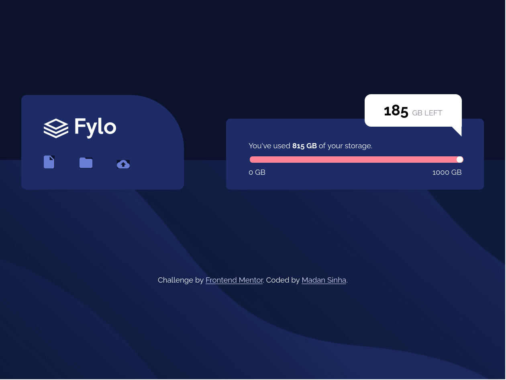

# Frontend Mentor - Fylo data storage component solution

This is a solution to the [Fylo data storage component challenge on Frontend Mentor](https://www.frontendmentor.io/challenges/fylo-data-storage-component-1dZPRbV5n). Frontend Mentor challenges helping me to improve my coding skills by building realistic projects. 

## Table of contents

- [Overview](#overview)
  - [The challenge](#the-challenge)
  - [Screenshot](#screenshot)
  - [Links](#links)
- [My process](#my-process)
  - [Built with](#built-with)
  - [What I learned](#what-i-learned)
  - [Continued development](#continued-development)
  - [Useful resources](#useful-resources)
- [Author](#author)
- [Acknowledgments](#acknowledgments)

**Note: Delete this note and update the table of contents based on what sections you keep.**

## Overview

I have seen this project very interesting and got to learned new things from this. 

### The challenge

Users should be able to:

- View the optimal layout for the site depending on their device's screen size
- Responsiveness of design
- Range Input
- Background of icon's

### Screenshot

### Links

- Solution URL: [GitHub Repository](hhttps://github.com/lazy4gyan/Frontend-fylo_data_storage)
- Live Site URL: [Challenge Preview](https://your-live-site-url.com)

## My process

### Built with

- Semantic HTML5 markup
- CSS custom properties
- Flexbox
- Mobile-first workflow

### What I learned

In this project, I have used flexbox and bem to complete this and also learned how to customize range input. But still feels like that I can do better than this which I will try to improve so that I can make a good project.

### Continued development

Now, I want to focus on flex,grid and webkit to make sites more responsive.

## Author

- Website - [Madan Sinha](https://codepen.io/MadanSinha/full/KKgERKR)
- Frontend Mentor - [@lazy4gyan](https://www.frontendmentor.io/profile/lazy4gyan)

## Acknowledgments

Without stackoverflow, w3classes and google, I am not able to complete this challenge.

